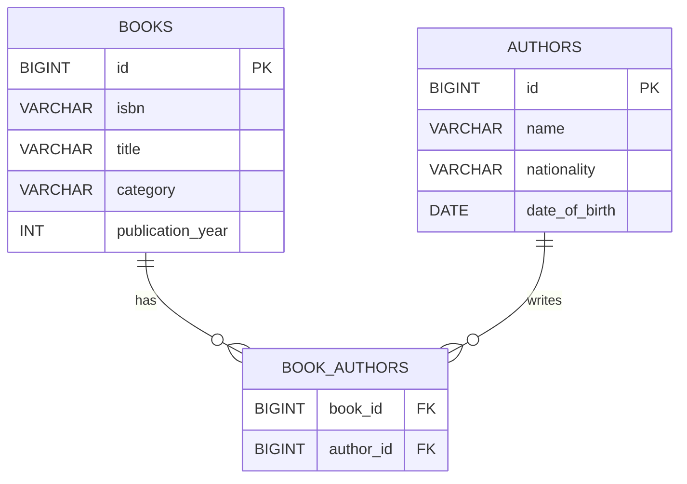

# ERD

```mermaid
erDiagram
    BOOKS ||--o{ BOOK_AUTHORS : has
    AUTHORS ||--o{ BOOK_AUTHORS : writes

    BOOKS {
        BIGINT id PK
        VARCHAR isbn
        VARCHAR title
        VARCHAR category
        INT publication_year
    }

    AUTHORS {
        BIGINT id PK
        VARCHAR name
        VARCHAR nationality
        DATE date_of_birth
    }

    BOOK_AUTHORS {
        BIGINT book_id FK
        BIGINT author_id FK
    }
```

Η σχέση βιβλίων και συγγραφέων είναι Many-to-Many. Για αυτό υπάρχει ο ενδιάμεσος πίνακας `book_authors`.
